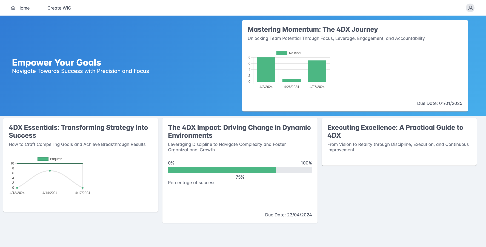
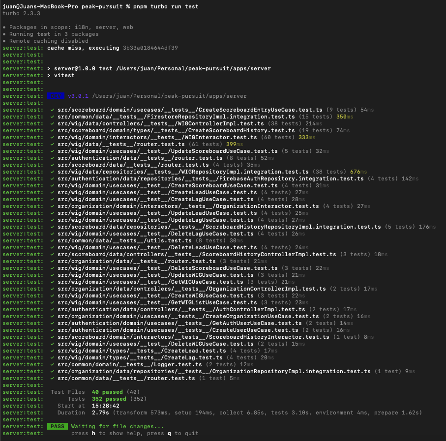
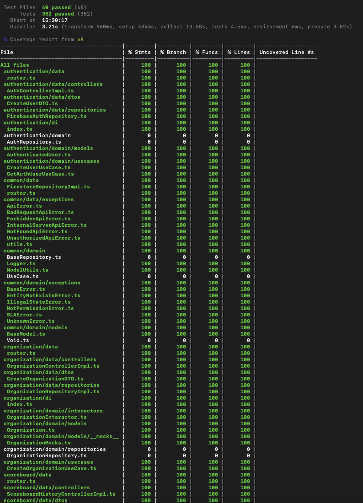
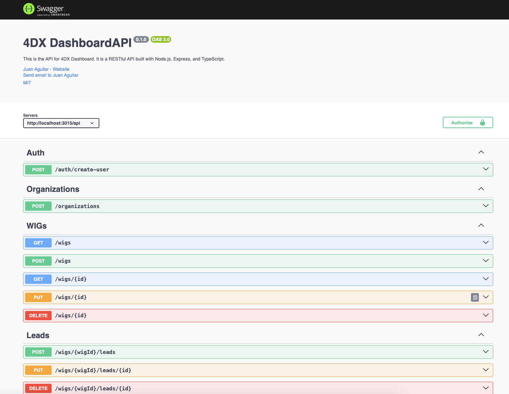

# 4DX Dashboard

## Presentation

Welcome to the **4DX Management Showcase**, a project built to manage WIGs (Wildly Important Goals), LEADs, and LAGs, serving as a practical example to highlight modern software development practices.

This repository is more than just a functional 4DX application—it's a **comprehensive showcase of a modern TypeScript monorepo**. It highlights how to build scalable, maintainable, and cleanly architected applications, leveraging cutting-edge technologies like **tRPC** for seamless server-client communication and **Vite** for lightning-fast development and builds. The technologies used are React and Node (Express), with the authentication and db layers powered by **Firebase**, enabling robust database and authentication capabilities.

Whether you're here to explore **best practices**, learn how to structure a **monorepo**, or get inspired by the thoughtful integration of tools and technologies, this project is built with you in mind. It's a sample repository that demonstrates:

- Clean architecture principles (applied in backend).
- Effective IDE configurations for smoother development workflows.
- A carefully curated combination of modern tools and technologies.

Dive in to discover how the pieces come together to create a powerful and elegantly designed application, and use this as a guide for your next TypeScript project! 🚀

# Technical Highlights

This project showcases a range of advanced technical implementations, demonstrating how to combine and use modern tools and best practices. Below are the key highlights:

---

## 1. **Purify TypeScript**

- Leveraged **Purify-TS** to enhance functional programming paradigms, ensuring safer and cleaner handling of data with `Maybe`, `Either`, and other monads.
- Enabled **strict TypeScript settings** for robust type checking, reducing runtime errors, and improving developer experience.
- Extensive use of advanced TypeScript features such as generics, utility types, and mapped types.

---

## 2. **Vite and Vitest Integration**

- Integrated **Vite** for blazing-fast development, with optimized builds and hot module replacement (HMR).
- Configured **Vitest** as the testing framework to ensure seamless unit testing, delivering a fast and developer-friendly testing experience.
- Achieved comprehensive test coverage using `vitest` and `@vitest/coverage-v8`.

---

## 3. **PrimeReact for UI Development**

- Adopted **PrimeReact**, a powerful library for building highly interactive and customizable UI components.
- Enhanced development speed and consistency by utilizing prebuilt, themable components such as data tables, charts, and dialogs.

---

## 4. **Clean Architecture with Eslint Boundaries Plugin**

- Implemented **Clean Architecture** principles to ensure a clear separation of concerns:
  - **Data Layer**: Repositories, DTOs, and Controllers.
  - **Domain Layer**: Business logic, Use Cases, and Models.
  - **DI Layer**: Dependency injection with Inversify.
- Configured **Eslint with Boundaries Plugin** to enforce architectural boundaries, ensuring that modules only interact as intended.
- Integrated **lint-staged** to run Eslint and Prettier checks on staged files before commits, maintaining code quality across the repository.

---

## 5. **tRPC + React Hook Form + Zod**

- Utilized **tRPC** to enable type-safe, full-stack communication between the frontend and backend without additional boilerplate.
- Combined **React Hook Form** with **Zod** for powerful and declarative form handling, including schema-based validation.
- Achieved seamless client-server validation by reusing Zod schemas across both ends, reducing redundancy and potential inconsistencies.

---

## 6. **Prettier and Eslint for Code Quality**

- Configured **Prettier** for consistent code formatting throughout the project.
- Implemented **Eslint** with plugins for TypeScript, import sorting, and best practices.
- Integrated Prettier and Eslint into the CI/CD pipeline, ensuring a clean and maintainable codebase.

---

## Product Overview

The 4DX Management application empowers you to manage your **Wildly Important Goals (WIGs)**, along with their associated **LEAD** and **LAG** measures. With intuitive dashboards, you can create and monitor scoreboards, update progress, and visualize performance through dynamic charts and values. Easily introduce data and track your organization's progress with streamlined functionality.

To see the application in action, check out the video demonstration below, showcasing the features and user interface. You can also explore the attached screenshots for a closer look at the clean design and functionality.

See the following video with a simple walkthrough:

[](https://youtu.be/-1txi3AoFMM)

## Features

- WIG management: Dashboard + detail.
- Different types of scoreboards: Linear, Counter to Total, Percentage.
- LEAD and LAG measurements and WIG update registry.
- I18N (English, Spanish).

## Architecture

The **4DX Management Showcase** is designed with a clean and scalable architecture to highlight best practices in modern software development. The application is structured as a **TypeScript monorepo**, leveraging the power of **Turborepo** and **PNPM** for efficient package management and build processes. Below are the key architectural highlights:

### Monorepo Structure

The repository is divided into three main packages:

1. **Shared (i18n)**: A shared library used by both the frontend and backend to manage internationalization (i18n) effectively. This ensures consistent translations across the entire application.
2. **Web (Frontend)**: The frontend application, built with React and Vite, focused on delivering a seamless user experience.
3. **Server (Backend)**: The backend application, powered by tRPC, adhering to clean architecture principles.

The **Turborepo** setup optimizes the development process with caching and parallel builds, while **PNPM** ensures efficient dependency management, reducing duplication and build times.

---

### Frontend Architecture

The frontend is designed with a clear folder structure and component hierarchy, drawing inspiration from these two sources:

1. **[A Front-End Application Folder Structure that Makes Sense](https://fadamakis.com/a-front-end-application-folder-structure-that-makes-sense-ecc0b690968b)**  
   This source was instrumental in organizing the folder structure, ensuring modularity, scalability, and clarity for the codebase.

2. **[Container-Presentational Pattern](https://tsh.io/blog/container-presentational-pattern-react/)**  
   This pattern defines the separation between container components (handling state and logic) and presentational components (focused on UI), creating a maintainable and reusable component hierarchy.

Key frontend features include:

- **State Management**: Efficiently managed using React Context and hooks.
- **Routing**: Handled by React Router, allowing a clear navigation structure.
- **Vite Integration**: For fast builds, hot module replacement (HMR), and optimized production builds.

---

### Backend Architecture

The backend adheres to **clean architecture** principles, emphasizing separation of concerns and modularity. The architecture is structured into the following layers:

#### Layers

1. **Data Layer**:

   - **Controllers**: Handle HTTP requests and map them to use cases.
   - **DTOs**: Define the data transfer objects for request and response validation.
   - **Repositories**: Implement database interactions.

2. **Domain Layer**:

   - **Models**: Define core business entities.
   - **Use Cases**: Represent the business logic and core application workflows.
   - **Repository Interfaces**: Abstract the database layer, ensuring flexibility and testability.

3. **DI Layer**:
   - Dependency Injection is managed using **InversifyJS**, ensuring loosely coupled and easily testable components.

#### Request Flow

The backend request flow follows a straightforward and logical sequence:

1. **Router**: Routes incoming requests to the appropriate controller.
2. **Controller**: Processes the request, validates input, and invokes the corresponding use case.
3. **Use Case**: Contains the core business logic. Optionally interacts with:
   - **Interactor**: Handles complex workflows or intermediate processing.
4. **Repository**: Accesses the database layer through the repository interface.
5. **Database**: Stores and retrieves data efficiently.

#### Backend Test

The backend test suite achieves 100% coverage using Vitest, ensuring robust and reliable code.

 

---

### Key Technologies

- **tRPC**: Facilitates type-safe communication between the frontend and backend.
- **Firebase**: Serves as the database, providing real-time data and robust authentication.
- **InversifyJS**: Manages dependency injection for clean and decoupled backend modules.

---

### Why This Architecture?

This architecture was carefully designed to:

- **Showcase Best Practices**: Demonstrates clean architecture principles, modular design, and efficient state management.
- **Ensure Scalability**: Easily accommodates new features and growing codebases.
- **Enable Maintainability**: Promotes a clear separation of concerns, making the codebase easy to understand, test, and extend.
- **Highlight Modern Tooling**: Leverages cutting-edge technologies like tRPC, Vite, and Turborepo for a robust development experience.

This project is not just a working application but a blueprint for building modern, scalable TypeScript applications. It's designed to impress, inspire, and serve as a valuable resource for any developer looking to adopt clean architecture and cutting-edge tools in their own projects.

## Swagger

The api is documented and available by default on /api-docs backend url.


# Installation and Testing Guide

Follow the steps below to set up, run, and test the project.

---

## Installation

Given my interest in working with Firebase, the installation process includes some of its more tedious aspects. As a next step, I plan to create another database repository using SQLite for direct use.

1. **Clone the Repository**  
   Clone the repository to your local machine using Git.
2. **Install Dependencies**  
   Use `pnpm` to install all dependencies in the root of the monorepo:

   ```bash
   pnpm install
   ```

3. **Set Up your Firebase account**

   - Sign up in Firebase and activate authentication and Firestore modules to be able to login and store data.
   - Create the config files neccesary to connect in backend and frontend. You can used the committed templates. I set the extension `.example`to all the files you need to configure, which are:
     - .env (server)
     - .firebaserc (server)
     - firebase.json (server)
     - firebase.json (web)

4. **Set Up an Organization and User**  
   Use the provided [Bruno collections](https://www.usebruno.com/) to simplify the creation of entities.

   - Obtain a JWT from Firebase (or temporarily make the API public—but let’s keep that secret, I’ll deny ever suggesting it!).
   - Create an organization (Organization/CreateOrganization).
   - Create a user for the organization (AUTH/CreateUser).

5. **Run the Project**  
   Start the development server with Turborepo:
   ```bash
   pnpm turbo run dev
   ```

---

## Running Tests

To run the integration tests, you need to set up Firebase emulators locally:

1. **Install Firebase Tools**  
   Install Firebase CLI globally:

   ```bash
   npm install -g firebase-tools
   ```

2. **Login to Firebase**  
   Log in to your Firebase account (only first time):

   ```bash
   firebase login
   ```

3. **Initialize Firebase in the Project**  
   Inside the project folder, initialize Firebase (only first time):

   ```bash
   firebase init
   ```

4. **Start Firebase Emulators**  
   Run the Firestore emulator to support integration tests:

   ```bash
   firebase emulators:start --only firestore
   ```

5. **Run Tests**  
   Execute the test suite using the following command:
   ```bash
   pnpm turbo run test
   ```

---

## Additional Commands

The project includes several commands to enhance the development workflow:

- **Build the Project**

  ```bash
  pnpm turbo run build
  ```

- **Lint and fix the Codebase**

  ```bash
  pnpm turbo run lint:fix
  ```

- **TypeScript Compliance**
  ```bash
  pnpm turbo run tsc
  ```

---

By following these steps, you can explore the project, run tests, and gain insights into its architecture and functionality. 🚀

## About the project

### Current Limits

- Organizations up to 5 WIGs.
- Organizations up to 10 users.
- WIGs up to 2 LEADs and 2 LAGs.
- Scoreboards up to 10 values.

## Next Steps

- Improve the installation process with prepopulated data or integration with a script to populate initial entities.
- Add organization and users management.
- Add new chart types.

# Contact and License

Thank you for exploring this project! If you have any questions, feedback, or opportunities, feel free to reach out.

- **LinkedIn**: [Juan Aguilar Guisado](https://www.linkedin.com/in/juanaguilarguisado)
- **X (formerly Twitter)**: [@aguilarguisado](https://twitter.com/aguilarguisado)

This project is licensed under the MIT License. You can find the full text in the [LICENSE.md](LICENSE.md) file.
